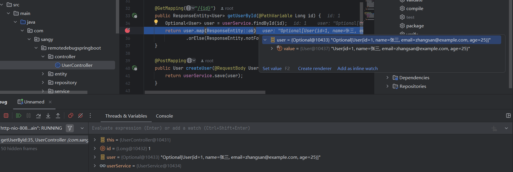

# remote-debug-springboot
# maven打包

```
# 编译并打包（跳过测试）
mvn clean package -DskipTests

# 编译、运行测试并打包
mvn clean package

# 快速打包（跳过测试和代码检查）
mvn clean package -DskipTests -Dcheckstyle.skip=true
```

# 构建镜像

```dockerfile
docker build -t sangy/remote-debug-springboot:1.0 -f ./Dockerfile .
```

# 运行容器

```dockerfile
# 后台启动服务
docker-compose -f docker-compose-app.yml up -d

# 或者如果文件名就是 docker-compose.yml，可以直接运行
docker-compose up -d
```

选择configuration当中的Remote JVM Debug即可，不过端口为**5005**

# 效果



